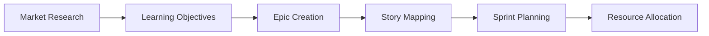

# MCP-Powered Agile Development for Instructors

## Retasking MCP Tools for Software Development Excellence

This guide reimagines every MCP tool as a component in your agile development pipeline, helping instructors prepare high-quality course materials and projects before students arrive.

## Tool Retasking Map

### Project Planning Phase

**Sequential Thinking Tools** → Sprint Planning Engine
- `decompose_learning_query` → **Epic Decomposer**: Break large features into teachable user stories
- `create_reasoning_chain` → **Dependency Mapper**: Identify task prerequisites and ordering
- `plan_meshnet_workflow` → **Sprint Orchestrator**: Design 2-week development cycles
- `track_thinking_process` → **Retrospective Analyzer**: Evaluate sprint effectiveness

**Taskmaster AI** → Project Management Suite
- `orchestrate_educational_workflow` → **Release Planner**: Map features to course modules
- `coordinate_meshnet_task` → **Resource Balancer**: Distribute work across TAs/co-instructors
- `adaptive_task_routing` → **Risk Manager**: Handle blocked tasks and dependencies
- `ai_assisted_planning` → **Feature Ideator**: Generate creative project ideas

### Ideation & Requirements Phase

**Web Search + Scout** → Market Research Tools
- Research current industry practices and student job requirements
- Find popular frameworks and tools students should learn
- Identify gaps in existing educational materials

**Google Drive** → Institutional Knowledge Base
- Search past course evaluations for improvement areas
- Find successful project templates from previous semesters
- Access department learning objectives and constraints

**Effect Docs** → Living Requirements Documentation
- `document_progress` → **Story Tracker**: Record user story evolution
- `discover_synergies` → **Feature Connector**: Find opportunities for integrated learning
- `generate_living_docs` → **Requirements Matrix**: Auto-updating feature/learning objective mapping

### User Story Creation

**Sequential Thinking** → Story Workshop
```python
# Retasked usage example:
story_components = decompose_learning_query(
    query="Student needs to build a REST API",
    style="exploratory",
    context={
        "skill_level": "intermediate",
        "prerequisites": ["HTTP basics", "JSON"],
        "time_available": "2 weeks"
    }
)
# Generates: As a student, I want to... acceptance criteria
```

**Analysis Tool** → Story Sizing Calculator
- Analyze complexity of code examples
- Estimate completion time based on student skill level
- Generate difficulty metrics for proper sprint loading

### Development Phase

**Filesystem Tools** → Project Scaffolder
- `create_directory` → Generate standard project structures
- `write_file` → Create boilerplate with teaching comments
- `directory_tree` → Visualize architecture for students

**Scout + Artifacts** → Code Generator with Best Practices
```python
# Workflow for creating teaching examples:
1. resolve_library_id("fastapi")  # Get latest docs
2. get_library_docs(topic="authentication")  # Current patterns
3. artifacts.create(  # Generate teaching example
    type="application/vnd.ant.code",
    content=authenticated_api_example
)
```

**Analysis Tool** → Live Coding Environment
- Test code snippets before class
- Generate performance comparisons
- Create interactive visualizations of algorithms

### Testing Phase

**Sequential Thinking** → Test Case Designer
- `create_reasoning_chain` → Generate edge cases students might miss
- Map learning objectives to test coverage

**Analysis Tool** → Automated Test Runner
```javascript
// Retasked for educational testing
import * as testFramework from 'custom-test-runner';

async function validateStudentCode(submissionPath) {
    const code = await window.fs.readFile(submissionPath);
    const testResults = runEducationalTests(code, {
        checkStyle: true,
        checkCorrectness: true,
        provideFeedback: true
    });
    return generateLearningReport(testResults);
}
```

**Effect Docs** → Test Documentation
- Auto-generate test case explanations
- Track common student errors for future prevention

### Debugging Phase

**Taskmaster AI** → Intelligent Debugging Assistant
- `adaptive_task_routing` → Route errors to appropriate solution paths
- `monitor_workflow_health` → Detect when students are stuck

**Sequential Thinking** → Debugging Pedagogy
```python
# Transform errors into learning opportunities
debug_lesson = create_reasoning_chain(
    problem="TypeError: Cannot read property 'x' of undefined",
    domain="JavaScript debugging",
    reasoning_style="inductive"
)
# Generates Socratic questions leading to understanding
```

## Integrated Workflows

### Workflow 1: Sprint Zero (Course Preparation)



**Implementation**:
1. **Market Research**: `web_search("junior developer skills 2025")` + `google_drive_search("industry advisory board feedback")`
2. **Learning Objectives**: `decompose_learning_query` each major skill into components
3. **Epic Creation**: `ai_assisted_planning` to generate project themes
4. **Story Mapping**: `orchestrate_educational_workflow` to sequence topics
5. **Sprint Planning**: `plan_meshnet_workflow` for 2-week cycles
6. **Resource Allocation**: `coordinate_meshnet_task` across teaching team

### Workflow 2: Rapid Project Development

```python
async function createCourseProject(concept, difficulty) {
    // 1. Ideation
    const ideas = await ai_assisted_planning({
        objective: `Create ${concept} project for ${difficulty} students`,
        constraints: ["2-week timeline", "teaches 3+ concepts", "industry-relevant"]
    });
    
    // 2. Requirements
    const stories = await decompose_learning_query(ideas.best_option);
    
    // 3. Scaffolding
    const structure = await generateProjectStructure(stories);
    await filesystem.create_directory(structure);
    
    // 4. Development
    const docs = await scout.get_library_docs(concept);
    const code = await artifacts.create({
        type: "application/vnd.ant.code",
        content: generateTeachingCode(docs, stories)
    });
    
    // 5. Testing
    const tests = await createEducationalTests(code);
    
    // 6. Documentation
    await effect_docs.generate_living_docs({
        doc_type: "workflow",
        include_metrics: true
    });
    
    return { project: code, tests, documentation };
}
```

### Workflow 3: Continuous Improvement Pipeline

**Pre-Semester**:
1. Analyze previous semester with `track_thinking_process`
2. Update materials using `adaptive_task_routing` based on pain points
3. Generate new examples with current tool versions via `scout`

**During Semester**:
1. `monitor_workflow_health` on student progress
2. `discover_synergies` between struggling concepts
3. `document_progress` for real-time curriculum adjustment

**Post-Semester**:
1. Comprehensive retrospective with all tracking data
2. Auto-generate improvement recommendations
3. Update living documentation for next instructor

## Agile Ceremonies via MCP

### Daily Standup (with TAs)
```python
# Automated standup generator
coordination_status = coordinate_meshnet_task({
    task_description: "Daily teaching team sync",
    required_capabilities: ["progress_tracking", "blocker_identification"],
    parallelization: True
})
```

### Sprint Planning
Use `plan_meshnet_workflow` with teaching objectives as "features" and class sessions as "sprints"

### Retrospectives
Combine `track_thinking_process` results with student feedback for data-driven improvements

## Power Patterns for Instructors

### Pattern: The Assignment Factory
```
Input: Learning objective
1. decompose_learning_query → Break into skills
2. web_search → Find industry examples
3. ai_assisted_planning → Generate creative project idea
4. create_reasoning_chain → Design solution approach
5. filesystem + artifacts → Generate starter code
6. analysis → Create test cases
7. effect_docs → Package everything
Output: Complete assignment package
```

### Pattern: The Debugging Dojo
```
Input: Common student error
1. create_reasoning_chain → Understand error deeply
2. scout → Find official documentation
3. artifacts → Create minimal reproduction
4. decompose_learning_query → Create teaching sequence
5. analysis → Interactive visualization
6. document_progress → Add to error library
Output: Reusable debugging lesson
```

### Pattern: The Curriculum Refactor
```
Input: Course feedback
1. google_drive_search → Gather all feedback
2. track_thinking_process → Analyze patterns
3. discover_synergies → Find connection opportunities
4. adaptive_task_routing → Prioritize changes
5. coordinate_meshnet_task → Distribute updates
6. generate_living_docs → Update course materials
Output: Improved curriculum
```

## Remember

You're not just using tools; you're building a teaching machine that:
- Reduces preparation time from weeks to days
- Ensures consistency across sections
- Adapts based on student performance
- Creates reusable, improving assets
- Models professional development practices

The secret is seeing each tool as a phase in your development pipeline, not just a utility. When students see you using the same agile practices you're teaching, the lessons become authentic and powerful.