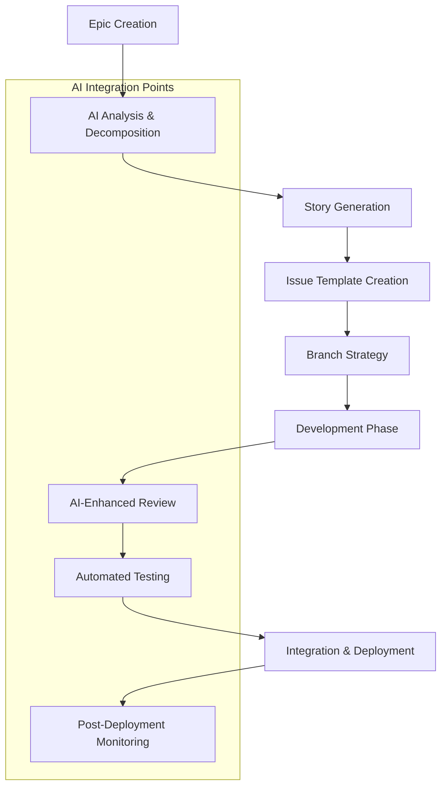

# Multi-Agent/LLM-Driven GitHub Workflow

## Overview

This guide establishes a comprehensive, best-practices-driven workflow for multi-agent and LLM-powered development in the SwarmRouter ecosystem. It leverages the power of AI assistants, automated tooling, and systematic decomposition to enable efficient, collaborative development.

## Core Principles

### 1. Agent-Assisted Development
- **AI-First Planning**: Use LLM agents to analyze requirements, decompose tasks, and suggest implementation approaches
- **Collaborative Intelligence**: Combine human expertise with AI assistance for optimal decision-making
- **Continuous Learning**: Agents learn from codebase patterns and previous decisions

### 2. Systematic Decomposition
- **Epic → Story → Task**: Break down complex features into manageable components
- **Dependency Mapping**: Identify and document inter-task dependencies
- **Parallel Development**: Enable multiple developers to work on different components simultaneously

### 3. Quality-First Approach
- **Prevention over Detection**: Use AI to catch issues before they reach production
- **Automated Validation**: Implement comprehensive CI/CD with AI-enhanced testing
- **Living Documentation**: Keep documentation synchronized with code changes

## Workflow Architecture



## Phase 1: Epic Planning & Decomposition

### 1.1 Epic Creation
Create high-level features using the following template:

```markdown
**Epic**: [HIVE-EPIC-X] Feature Name
**Business Value**: Clear statement of user/system benefit
**Technical Scope**: High-level technical components involved
**Acceptance Criteria**: 
- [ ] Measurable outcomes
- [ ] Performance requirements
- [ ] Integration requirements
**Estimated Effort**: T-shirt sizing (XS, S, M, L, XL)
**Dependencies**: List of blocking requirements
```

### 1.2 AI-Assisted Analysis
Use LLM agents to analyze epics:

```bash
# Example: Using Claude or similar LLM for epic analysis
@claude analyze epic: "[HIVE-EPIC-X] Feature Name"
- Identify technical risks
- Suggest decomposition strategy
- Recommend implementation approach
- Estimate complexity and dependencies
```

### 1.3 Story Decomposition
Break epics into user stories with clear boundaries:

```markdown
**Story**: [HIVE-X.Y] Specific User Story
**As a** [user type]
**I want** [functionality]
**So that** [business value]

**Technical Details**:
- API endpoints required
- Data models involved
- Integration points
- Performance requirements

**Definition of Done**:
- [ ] Code implementation complete
- [ ] Unit tests written (≥80% coverage)
- [ ] Integration tests passing
- [ ] Documentation updated
- [ ] AI code review passed
- [ ] Manual testing completed
```

## Phase 2: Issue Management & Branching

### 2.1 Issue Template Usage
Create issues using the standardized template (see `docs/issue_template.md`):

```markdown
**Priority**: Critical/High/Medium/Low
**Component**: [API/Frontend/Database/Infrastructure]
**Sprint**: Target sprint number
**Assignee**: Developer or AI agent identifier
**Related Issues**: Links to dependencies
**AI Assistance Level**: [Full/Partial/Manual]
```

### 2.2 Branching Strategy
Implement feature-branch workflow with AI integration:

```bash
# Branch naming convention
feature/hive-{epic-number}-{story-number}-{brief-description}
bugfix/issue-{number}-{brief-description}
ai-enhancement/{component}-{improvement-type}

# Example branches
feature/hive-1-2-user-authentication
bugfix/issue-45-api-timeout
ai-enhancement/core-performance-optimization
```

### 2.3 Multi-Agent Coordination
Assign different aspects to specialized agents:

- **Architect Agent**: System design and technical planning
- **Code Agent**: Implementation and refactoring
- **Test Agent**: Test strategy and automation
- **Review Agent**: Code quality and best practices
- **Documentation Agent**: Technical writing and updates

## Phase 3: Development Workflow

### 3.1 AI-Enhanced Development
Integrate AI assistance throughout development:

```bash
# Pre-development analysis
@claude analyze requirements for story [HIVE-X.Y]
- Review acceptance criteria
- Suggest implementation approach
- Identify potential edge cases
- Recommend testing strategy

# During development
@claude review code changes
- Check for best practices
- Identify security concerns
- Suggest optimizations
- Validate against requirements

# Pre-commit validation
@claude validate changeset
- Ensure completeness
- Check test coverage
- Verify documentation updates
- Confirm API compatibility
```

### 3.2 Continuous Integration Points
Implement AI checkpoints throughout CI/CD:

1. **Code Quality Gates**
   - Automated linting with AI suggestions
   - Complexity analysis and recommendations
   - Security vulnerability scanning

2. **Test Validation**
   - AI-generated test cases for edge scenarios
   - Automated test coverage analysis
   - Performance regression detection

3. **Documentation Sync**
   - Auto-update API documentation
   - Generate user-facing documentation
   - Validate code-documentation consistency

### 3.3 Collaborative Review Process
Multi-layered review approach:

```markdown
**Review Levels**:
1. **AI Pre-Review**: Automated analysis using LLM agents
2. **Peer Review**: Human developer review
3. **Domain Expert Review**: Subject matter expert validation
4. **Final AI Validation**: Comprehensive system impact analysis

**Review Checklist**:
- [ ] Code quality and maintainability
- [ ] Security implications
- [ ] Performance impact
- [ ] API compatibility
- [ ] Test coverage and quality
- [ ] Documentation completeness
- [ ] Business logic correctness
```

## Phase 4: Quality Assurance & Testing

### 4.1 AI-Enhanced Testing Strategy
Leverage AI for comprehensive testing:

```python
# Example: AI test generation
@ai_test_generator
def generate_tests_for_function(function_signature, business_logic):
    """
    AI generates comprehensive test cases including:
    - Happy path scenarios
    - Edge cases and boundary conditions
    - Error handling scenarios
    - Performance edge cases
    - Security validation tests
    """
    pass

# Example: AI test review
@ai_test_reviewer
def review_test_suite(test_files, coverage_report):
    """
    AI reviews test suite for:
    - Coverage gaps
    - Missing edge cases
    - Test quality and maintainability
    - Performance test adequacy
    """
    pass
```

### 4.2 Automated Quality Gates
Implement progressive quality validation:

```yaml
# Quality gate configuration
quality_gates:
  unit_tests:
    coverage_threshold: 80%
    ai_validation: required
  
  integration_tests:
    api_compatibility: required
    performance_baseline: required
  
  security_tests:
    vulnerability_scan: required
    ai_security_review: required
  
  documentation:
    api_docs_updated: required
    user_docs_updated: conditional
```

### 4.3 Performance & Monitoring
AI-powered performance optimization:

```bash
# Performance monitoring with AI insights
@claude analyze performance metrics
- Identify bottlenecks
- Suggest optimizations
- Predict scaling issues
- Recommend infrastructure changes

# Automated performance testing
@ai_performance_tester
- Generate realistic load scenarios
- Identify performance regressions
- Optimize database queries
- Monitor resource utilization
```

## Phase 5: Integration & Deployment

### 5.1 Pre-Deployment Validation
AI-assisted deployment readiness:

```markdown
**Deployment Checklist**:
- [ ] All CI/CD pipelines passing
- [ ] AI security scan completed
- [ ] Performance benchmarks met
- [ ] Documentation updated
- [ ] Rollback plan prepared
- [ ] Monitoring alerts configured
- [ ] Stakeholder notification sent
```

### 5.2 Progressive Deployment
Implement safe deployment practices:

1. **Feature Flags**: AI-controlled rollout based on metrics
2. **Canary Releases**: Gradual exposure with AI monitoring
3. **Blue-Green Deployment**: Zero-downtime deployment with AI validation
4. **Rollback Triggers**: AI-powered automatic rollback on anomalies

### 5.3 Post-Deployment Monitoring
Continuous AI-powered monitoring:

```python
# AI monitoring integration
@ai_monitor
def post_deployment_analysis():
    """
    AI monitors:
    - System performance metrics
    - User behavior changes
    - Error rate fluctuations
    - Security anomalies
    - Business metric impacts
    """
    return monitoring_report
```

## Phase 6: Continuous Improvement

### 6.1 Retrospective Analysis
AI-enhanced retrospectives:

```markdown
**AI Retrospective Template**:

**What Went Well**:
- AI-identified successful patterns
- Efficiency improvements
- Quality metrics achievements

**What Could Be Improved**:
- AI-detected bottlenecks
- Process inefficiencies
- Quality gaps

**Action Items**:
- Process improvements
- Tool enhancements
- Training needs
- AI agent optimization
```

### 6.2 Knowledge Management
Maintain living knowledge base:

```bash
# AI-powered knowledge extraction
@claude extract patterns from completed stories
- Document successful approaches
- Identify reusable components
- Update best practices
- Create learning materials

# Knowledge sharing
@claude generate onboarding materials
- Create developer guides
- Update process documentation
- Generate training examples
- Maintain FAQ database
```

### 6.3 Process Evolution
Continuously evolve workflow based on AI insights:

1. **Metric Analysis**: AI tracks team efficiency and quality metrics
2. **Pattern Recognition**: Identify successful practices and anti-patterns
3. **Process Optimization**: Suggest workflow improvements
4. **Tool Enhancement**: Recommend new tools and integrations

## Tool Integration

### Development Tools
- **IDEs**: VS Code with AI extensions (GitHub Copilot, Claude Dev)
- **Project Management**: GitHub Issues with AI-powered templates
- **Communication**: Slack/Discord with AI bot integration
- **Documentation**: GitBook/Notion with AI content generation

### AI/LLM Platforms
- **Code Assistance**: GitHub Copilot, Claude Dev, Cursor
- **Code Review**: Claude Code Review, AI-powered PR analysis
- **Testing**: AI test generation and validation tools
- **Documentation**: AI-powered documentation generation

### CI/CD Integration
- **GitHub Actions**: AI-enhanced workflows (see `docs/sample_ci.yml`)
- **Quality Gates**: SonarQube with AI analysis
- **Security**: Snyk/CodeQL with AI threat detection
- **Performance**: AI-powered performance monitoring

## Metrics & KPIs

### Development Efficiency
- **Story Completion Rate**: Target 90% within sprint
- **AI Assistance Utilization**: Track AI tool usage and effectiveness
- **Code Review Cycle Time**: Target <24 hours for first review
- **Deployment Frequency**: Target daily deployments for mature features

### Quality Metrics
- **Bug Escape Rate**: Target <1% to production
- **Test Coverage**: Maintain ≥80% across all components
- **AI Code Quality Score**: Custom metric based on AI analysis
- **Security Vulnerabilities**: Zero critical, minimal high-severity

### Team Productivity
- **Developer Satisfaction**: Quarterly surveys on AI tool effectiveness
- **Knowledge Sharing**: Track documentation updates and team learning
- **Process Improvement**: Monthly retrospective action item completion
- **Innovation Rate**: Track new AI integration and process improvements

## Getting Started

### For New Team Members
1. **Complete Onboarding**: Follow AI-generated personalized learning path
2. **Shadow Experience**: Pair with experienced developer and AI agents
3. **Starter Issues**: Begin with "good first issue" tagged items
4. **Tool Setup**: Configure development environment with AI assistance

### For Existing Teams
1. **Pilot Project**: Start with low-risk feature using this workflow
2. **Gradual Adoption**: Introduce AI tools incrementally
3. **Training Program**: Develop team skills in AI-assisted development
4. **Process Iteration**: Refine workflow based on team feedback

### Implementation Timeline
- **Week 1-2**: Tool setup and team training
- **Week 3-4**: Pilot project with simplified workflow
- **Week 5-8**: Full workflow implementation with monitoring
- **Week 9-12**: Optimization and process refinement

## Best Practices Summary

### Do's
✅ **Use AI for analysis and planning before coding**
✅ **Maintain clear issue decomposition and dependencies**
✅ **Implement progressive quality gates with AI validation**
✅ **Keep documentation synchronized with AI assistance**
✅ **Monitor and optimize AI tool effectiveness**
✅ **Share knowledge and patterns across the team**

### Don'ts
❌ **Don't rely solely on AI without human oversight**
❌ **Don't skip manual testing and validation steps**
❌ **Don't merge without proper code review process**
❌ **Don't ignore AI recommendations without justification**
❌ **Don't forget to update documentation and tests**
❌ **Don't deploy without proper monitoring setup**

## References

- [GitHub Flow](https://guides.github.com/introduction/flow/)
- [Conventional Commits](https://www.conventionalcommits.org/)
- [AI-Assisted Development Best Practices](https://github.com/features/copilot/plans)
- [SwarmRouter Architecture Documentation](./system-architecture.md)
- [Issue Template Guide](./issue_template.md)
- [CI/CD Workflow Examples](./sample_ci.yml)

---

*This workflow is designed to evolve with your team's needs and AI tool capabilities. Regular retrospectives and process improvements are essential for continued success.*